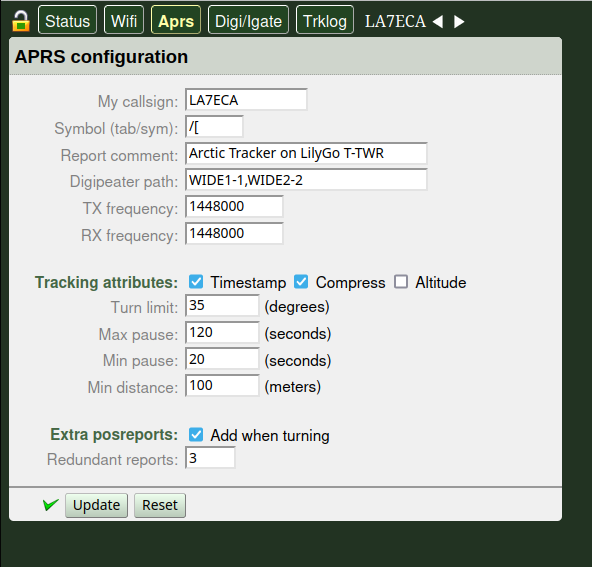

# ArcticTracker-Webapp
Web application for setup of Arctic Tracker using the tracker's REST API.
* It can handle muliple trackers and configure the most important settings. For full control, use the command shell via the USB port. 
* Additional trackers on the same LAN can be automatically discovered using mDNS.
* It uses strong authentication (Shared secret + HMAC).
* It supports CORS so the origin of the webapp can be different from the tracker itself.
* Responsive design/smartphone app. 

## Usage
This webapp is also included in the Arctic Tracker firmware. Point your web-broser to the tracker. The IP address and the mDNS hostname is shown on the display if connected to a WIFI access point. The browser and the tracker has to be on the same LAN. If the tracker is used as a soft-ap, you can also find the SSID and the IP-address on the display. The webapp can also be used from http://arctictracker.no/webapp (if your trackers are connected via WIFI to your LAN). 

Currently the tracker uses a *self-signed certificate* so you may need to accept the certificate the first time you use it from a browser. It is a good idea to try access the tracker directly from your web-browser when its firmware is updated to make sure that the certificate-exception is there.   

You can enter the callsign and the api-key in the "Access and Key setup" and press "add" (or "update"). Alternatively you can use the IP-address instead of the callsign (if connected to its soft-ap or not on the same LAN). If the we are successfully authenticated with the tracker, the callsign/IP will become green. You can remove it by pressing the red cross on the left side of the symbol.  

To install your own version you copy the webapp to a location where it can be reached by your web-browser. 

If there is sufficient interest, I can make the smartphone app available (Android). 

## Building

The webapp now uses webpack for building and bundling the JavaScript and CSS files. 

### Prerequisites
- Node.js and npm installed on your system

### Build Process

1. Install dependencies:
```bash
npm install
```

2. Build for production:
```bash
npm run build
```

This will:
- Bundle all JavaScript files from `src/` into `arcticsetup-min.js`
- Combine and minify all CSS files from `style/` into `style/style-min.css`
- Minify and optimize all assets

3. For development builds (with source maps):
```bash
npm run build:dev
```

4. Watch mode for continuous development:
```bash
npm run watch
```

### Legacy Build Script

The original `compile-js.sh` bash script is still available for reference but has been replaced by the webpack build system.

